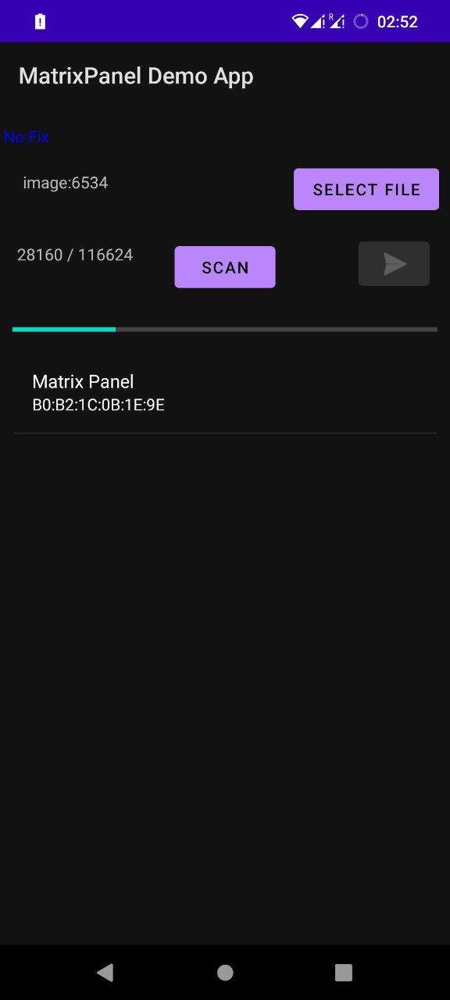

# ESP32 Matrix Panel Companion App
This is a barebones example of an app to send and receive data to the ESP32 Matrix panel available here: https://github.com/meganukebmp/ESP32_BLE_Matrixpanel.

The app allows you to scan for devices running the project, connect to them and send them gifs to display. The app also subscribes to a characteristic (in this case GPS) to showcase the potential capabilities of a BLE enabled device with data transfer.

### Notes
This app is honestly quite terrible right now. It's a single activity doing everything. There is no background service or any background threads to keep the BLE connection alive. There is absolutely zero error handling. You have to make sure your Bluetooth and Location are turned on prior to scanning or connecting. Callbacks trigger callback to trigger various events. There is a lot of improvement but it works. I sincerely hope no one uses it downright as is and takes the time to learn from it and design something better for themself.

### Libraries used
* [BLESSED](https://github.com/weliem/blessed-android) - A fantastic BLE library for Android doing 99% of the heavy lifting in this app. Initially I tried using the normal Android API but quickly realised how tedious it would be (and time consuming given how little documentation there is on the topic). This library singlehandedly made this project possible.